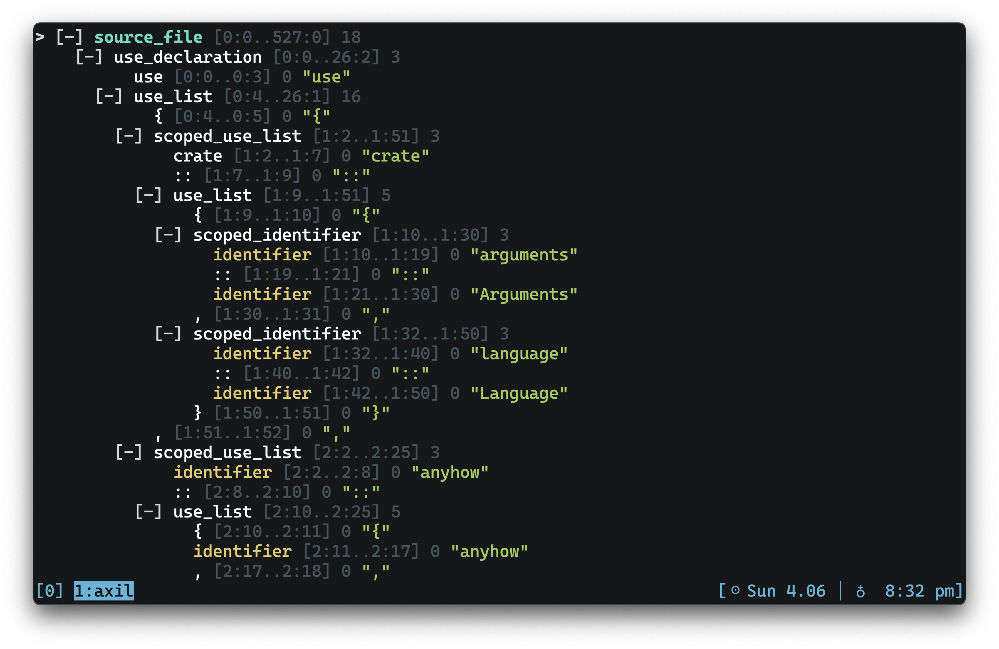

## axil

[](https://github.com/terror/axil/releases/latest)
[](https://github.com/terror/axil/actions/workflows/ci.yaml)
[](https://codecov.io/gh/terror/axil)
[](https://github.com/terror/axil/releases)

`axil` is a terminal user interface for
[tree-sitter](https://tree-sitter.github.io/tree-sitter/), the parser generator
tool and incremental parsing library.



`axil` lets you explore and query syntax trees interactively, including:

- Browse the full syntax tree in an interactive TUI with vim-style navigation
  (`h`/`j`/`k`/`l`), collapsible nodes, and half-page scrolling.

- Search for node types with `/`, jumping between matches with `n`/`N`.

- Run tree-sitter queries live with `?`, seeing matched nodes highlighted in
  real time.

- Yank the source text of any node to the clipboard with `y`.

- Mouse support for click-to-navigate and scroll wheel.

- Print the syntax tree to stdout for non-interactive use, with optional
  `--query` highlighting.

- Supports 15+ languages out of the box: Bash, C, C++, CSS, Go, HTML, and more.

If you need help with `axil` please feel free to open an issue. Feature requests
and bug reports are always welcome!

## Installation

`axil` should run on any system, including Linux, MacOS, and the BSDs.

The easiest way to install it is by using
[cargo](https://doc.rust-lang.org/cargo/index.html), the Rust package manager:

```bash
cargo install axil
```

Otherwise, see below for the complete package list:

#### Cross-platform

<table>
  <thead>
    <tr>
      <th>Package Manager</th>
      <th>Package</th>
      <th>Command</th>
    </tr>
  </thead>
  <tbody>
    <tr>
      <td><a href=https://www.rust-lang.org>Cargo</a></td>
      <td><a href=https://crates.io/crates/axil>axil</a></td>
      <td><code>cargo install axil</code></td>
    </tr>
  </tbody>
</table>

### Pre-built binaries

Pre-built binaries for Linux, MacOS, and Windows can be found on
[the releases page](https://github.com/terror/axil/releases).

## Usage

Running `axil` with a file path prints the syntax tree to stdout:

```console
$ axil example.json
document [0:0..3:0]
  object [0:0..2:1]
    { [0:0..0:1] "{"
    pair [1:2..1:16]
      string [1:2..1:7]
        " [1:2..1:3] "\""
        string_content [1:3..1:6] "foo"
        " [1:6..1:7] "\""
      : [1:7..1:8] ":"
      string [1:9..1:16]
        " [1:9..1:10] "\""
        string_content [1:10..1:15] "hello"
        " [1:15..1:16] "\""
    } [2:0..2:1] "}"
```

The language is automatically detected from the file extension. When reading
from stdin, pass `--language` explicitly:

```console
$ echo '{"foo": "hello"}' | axil --language json
```

### Interactive Mode

The `--interactive` flag opens the syntax tree in a full-screen TUI where you
can browse and explore the tree. Navigation is vim-style: `h`/`j`/`k`/`l` to
move around, `Enter` to collapse and expand nodes, and `Space` to select a node
and view its details in an info panel.

```console
$ axil main.rs --interactive
```

You can search for node types by pressing `/` and typing a pattern. Jump between
matches with `n` and `N`. Press `y` on any node to yank its source text to the
clipboard.

### Tree-sitter Queries

The `--query` flag runs a
[tree-sitter query](https://tree-sitter.github.io/tree-sitter/using-parsers/queries/index.html)
against the syntax tree and highlights matching nodes. In print mode, only nodes
matching the query are shown:

```console
$ axil main.rs --query '(function_item name: (identifier) @name)'
```

In interactive mode, press `?` to enter a query live. Matched nodes are
highlighted in real time as you type, and you can jump between them with `n` and
`N`.

### Keybindings

| Key       | Action                       |
| --------- | ---------------------------- |
| `j` / `k` | Move down / up               |
| `h` / `l` | Move to parent / first child |
| `g` / `G` | Jump to top / bottom         |
| `Ctrl-u`  | Scroll up half page          |
| `Ctrl-d`  | Scroll down half page        |
| `Enter`   | Toggle collapse              |
| `Space`   | Toggle select                |
| `/`       | Search node types            |
| `n` / `N` | Next / previous search match |
| `?`       | Enter tree-sitter query      |
| `y`       | Yank node text to clipboard  |
| `Esc`     | Clear search                 |
| `q`       | Quit                         |

## Prior Art

Check out [tree-sitter](https://tree-sitter.github.io/tree-sitter/), the parser
generator tool and incremental parsing library.
